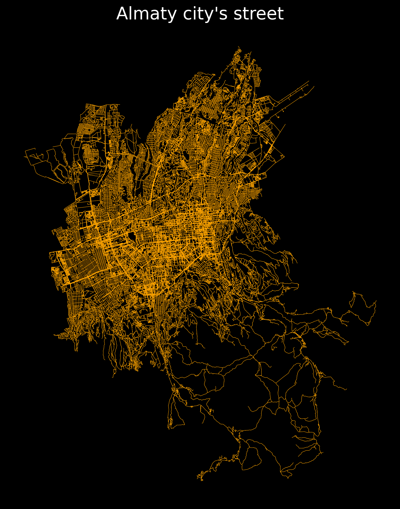

# Almaty-city-streets

I created a map of the Almaty city road network using Python.

I developed this visualization using Python, using the osmnx (OpenStreetMap) and matplotlib (visualization) libraries

The visualization shows all the automobile streets of the city of Almaty.

- The city center is denser than the outskirts.

- Straight streets in the center and winding streets on the outskirts.

- Suburban areas and rural roads are displayed.

- On the map you can see the outlines of the Almaty Hippodrome, Lake Sairan, the KazNU campus and the Almaty Arena stadium, and so on

- The center has the best transport network. 

- Central areas are planned with a grid, new areas are adapted to the landscape.

- Visualization shows the stages of the city's growth.
- 
This visualization helps to better understand the structure and development of Almaty!

